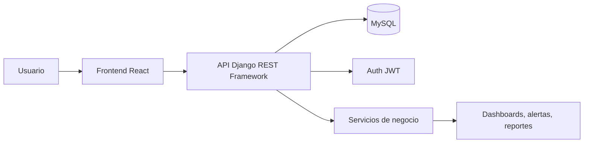

# Arquitectura de BOXTRACK

## 1. Objetivo
BoxTrack propone una plataforma para clubes y academias de boxeo con foco en la gestión administrativa y el seguimiento deportivo. La solución prioriza indicadores útiles para entrenadores, administradores y deportistas, en vez de una simple administración de gimnasios.

## 2. Arquitectura general

## 3. Capa frontend

- React + Vite
- Rutas protegidas por rol
- Componentes reutilizables para cards, tables, forms y charts
- Diseño mobile-first con menú lateral en desktop
- Recharts para estadísticas y evolución deportiva
- Lucide para iconografía
- Axios para consumo de API

## 4. Capa backend

- Django como framework principal
- DRF para endpoints REST
- JWT para sesión y autenticación
- Modelos por dominio para aislar responsabilidades
- Permisos por club y por rol
- Validaciones en servidor y middlewares de seguridad

## 5. Base de datos

- MySQL 8.0+
- Modelo relacional normalizado
- Relación obligatoria entre usuarios, clubes y roles
- Aislamiento por club para evitar fuga de información
- Índices sobre búsquedas frecuentes y relaciones clave

## 6. Modelos esperados

### Entidades principales
- Club
- Usuario
- Perfil de usuario
- Rol
- Permiso
- Deportista
- Perfil de competidor, con grupo de preparación diferenciado y récord derivado del historial de combates
- Entrenador
- Grupo
- Entrenamiento / clase programada, con capacidad máxima
- Reserva de cupo del deportista en una clase
- Asistencia
- Evaluación deportiva
- Registro de peso
- Competencia
- Resultado de combate
- Alerta
- Notificación
- Objetivo deportivo

## 7. Seguridad

- JWT con tokens de acceso y refresh
- Control de acceso por roles: administrador, entrenador, deportista
- Matriz de permisos:
    - Administrador: crea cuentas, administra perfiles y grupos, programa clases y gestiona la configuración del club.
    - Entrenador: consulta deportistas y grupos; programa clases, registra asistencia y mantiene el seguimiento deportivo y alertas. No administra cuentas ni perfiles del equipo.
    - Deportista: consulta clases, reserva o cancela sus propios cupos y consulta sus notificaciones.
- Los permisos se validan en la API; ocultar una opción en el frontend no sustituye la autorización del backend.
- Validación que un club no acceda a otra base de datos
- Protección de rutas en frontend y backend
- Enmascaramiento de datos sensibles
- Auditoría de acciones relevantes

## 8. Plan de desarrollo recomendado

### Etapa 1: base
- Inicializar proyecto Django
- Configurar settings y base de datos
- Definir auth y roles
- Crear migraciones base

### Etapa 2: entidades de negocio
- Clubes, usuarios, deportistas y entrenadores
- Asignaciones y perfiles de usuario

### Etapa 3: entrenamiento y asistencia
- Grupos, actividades, clases disponibles y calendario
- Reserva y cancelación de cupos por deportistas, respetando la capacidad de cada clase
- Registro de asistencia efectiva por parte del entrenador; reservar un cupo no equivale a asistir
- Evitar reservas duplicadas y sobrepasar la capacidad de una clase

### Etapa 4: seguimiento deportivo
- Plantel general y equipo de competidores, evaluaciones, récord de peleas, historial de peso y evolución

### Etapa 5: tienda del gimnasio
- Catálogo y stock por club
- Carrito, pedidos y estado de pago/entrega
- Checkout integrado con proveedor de pago configurado y confirmación por webhook

### Etapa 5: analítica y alertas
- Dashboard, análisis rule-based y notificaciones internas

### Etapa 6: reportes y pruebas
- Exportación, reportes y test suite

### Etapa 7: UX y despliegue
- Responsive design, PWA, documentación y preparación de despliegue

## 9. Decisiones clave

- Se usarán módulos por dominio para mantener la escalabilidad y facilitar la defensa del proyecto.
- La gestión de usuarios y clubes se resolverá con una estructura de autorización robusta desde el backend.
- Cada entidad vinculada a un club deberá incluir una referencia explícita al club para garantizar aislamiento de datos.
- Los dashboards y alertas se construirán desde datos reales, nunca valores artificiales.
